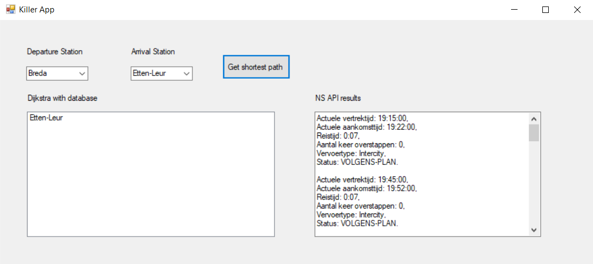

# TrainInformation application
## Summary
This application is made for the FUN2 course at my Fontys education.  
It revolves around train times between big cities in the Netherlands.  

As an extra challenge I decided to also implement the NS (Dutch railway cooperation) API in order to get up-to-date departure and arrival times amongst other things like the time the journey will take.  

### Application interface

## Run the application  
If you want to run this application you'll need a MySQL database.  
The database file is provided in the form of 'traininformation.sql' with an extra reference to the content in 'Afstanden.pdf'.  
In order to make the database connection you'll need to edit the [DatabaseConnection.cs file](https://github.com/Martijnvos/TrainInformation/blob/master/Killer%20App%20Windows%20Forms/DatabaseConnection.cs)  

You also need to provide your own NS API key in the [NS API call.cs file](https://github.com/Martijnvos/TrainInformation/blob/master/Killer%20App%20Windows%20Forms/NS%20API%20call.cs).  

After configuring those things you can run the application Visual Studio!